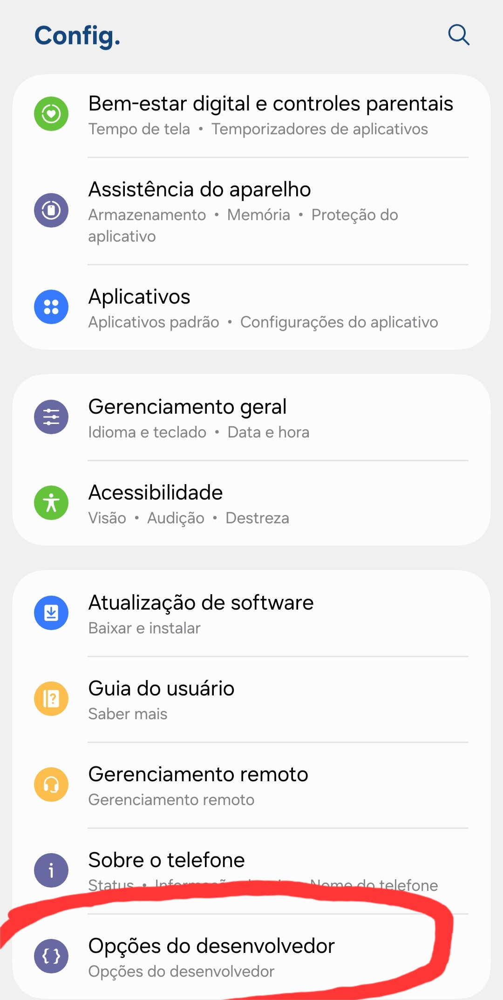
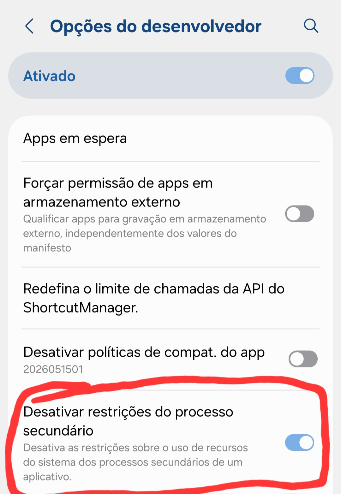

# oksalev

**Miguel** - @miguel246515

---

## 📱 Passo a passo antes de começar

### 1️⃣ Ativar opções do desenvolvedor

Vá em **Configurações → Sobre o telefone** e clique 7 vezes em **Número da build** até ativar o modo desenvolvedor.



### 2️⃣ Ativar restrições do processo secundário

Dentro de **Configurações → Opções do desenvolvedor**, ative a opção **"Restrições do processo secundário"**.



### 3️⃣ Baixar os apps necessários

- **Termux** (versão F-Droid, NÃO use a da Play Store):  
  👉 https://f-droid.org/repo/com.termux_118.apk

- **Termux:X11** (para exibir o desktop):  
  👉 https://f-droid.org/repo/com.termux.x11_12.apk

### 4️⃣ Instalar git dentro do Termux

Abra o Termux e digite:

```bash
pkg install git
```

### 5️⃣ O que é isso?

Um script install.sh que transforma seu Termux em um desktop XFCE rodando em dispositivos ARM64 (a maioria dos celulares Android).

O que o script faz?

1. Atualiza o Termux
2. Instala o XFCE (ambiente desktop)
3. Configura o básico para rodar
4. Deixa tudo pronto pra usar

Como usar

```bash
git clone https://github.com/mgoksalev/oksalev
cd oksalev
chmod +x install.sh
./install.sh
```

Depois da instalação, inicie o desktop com:

```bash
./start.sh
```

### 6️⃣ Requisitos

· Android 8 ou superior

· Termux instalado (versão F-Droid)

· 2GB RAM de espaço livre
